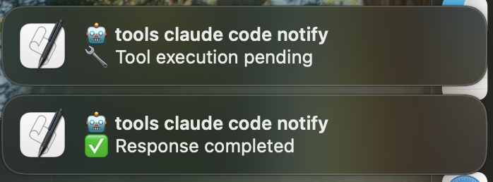

# Claude Code Notify

Get desktop notifications when Claude Code requests tool execution permission or completes tasks.



## Features

- 🔔 Simple desktop notifications for Claude Code interactions
- 🎵 Different notification sounds (Ping for tool requests, Glass for completions)
- 🍎 Native macOS integration

## Getting Started

### 1. Run the Tool

No installation required! Use directly with npx:

```bash
npx claude-code-notify
```

This automatically downloads and runs the latest version from npm.

### 2. Enable Notification Permissions

1. Open **System Settings** → **Notifications**
2. Find and select **Script Editor** from the list
3. Ensure "Allow Notifications" is checked
4. Configure notification style (Banner or Alert)
5. Test with: `osascript -e "display notification \"Test\" with title \"Test\""`

### 3. Configure Claude Code Hook

1. In Claude Code, run the `/hooks` command
2. Select **Notification** from the list
3. Choose **Add new hook**
4. Enter `npx claude-code-notify` as the command
5. Save the configuration

This setup ensures you always use the latest version without manual installation.

## Notification Types

The script provides simple, clear notifications:

- **Tool Execution Requests**: When Claude asks for permission to execute commands

  - Sound: Ping
  - Message: "🔧 Tool execution pending"

- **Task Completion**: When Claude completes a response
  - Sound: Glass
  - Message: "✅ Response completed"

## Requirements

- macOS (uses `osascript` for notifications)
- Claude Code with hooks functionality
- Bash shell

## How It Works

1. Claude Code executes the notification script via hooks
2. Script finds the latest conversation file in `~/.claude/projects`
3. Determines notification type based on message content
4. Displays native macOS notification with appropriate sound

## License

MIT
